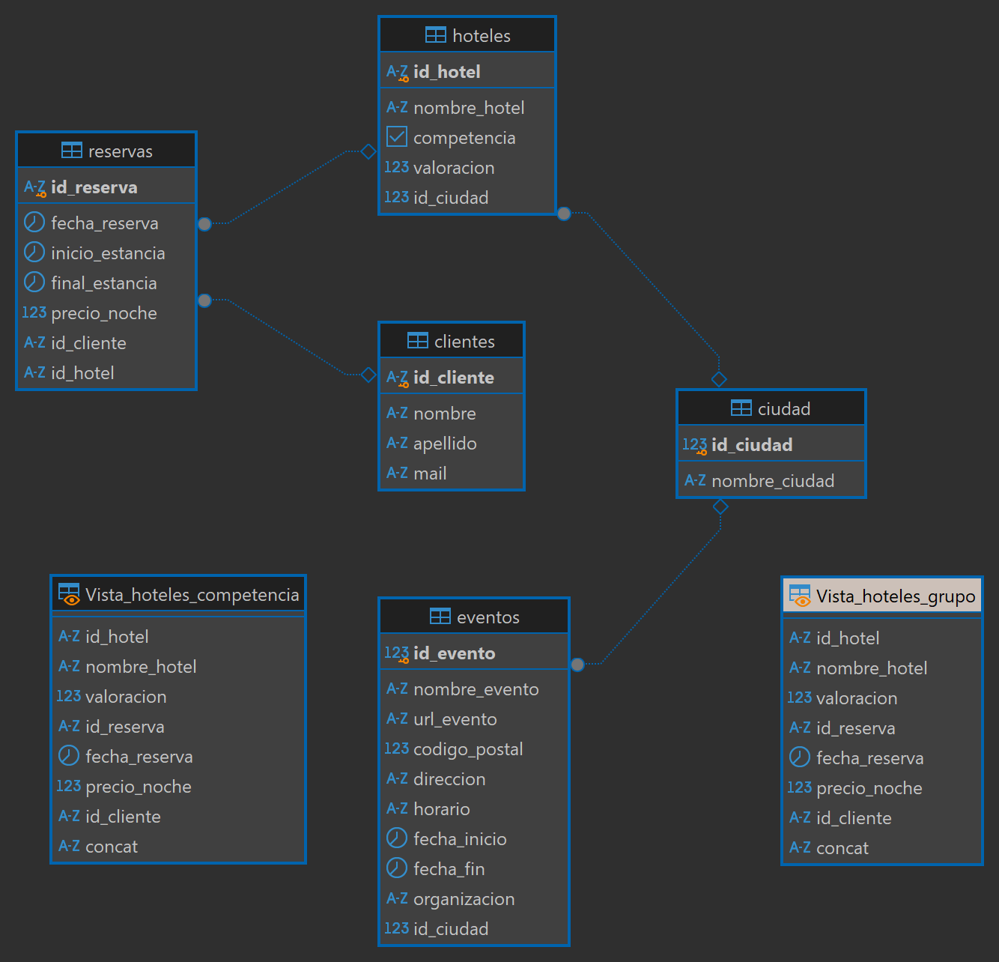
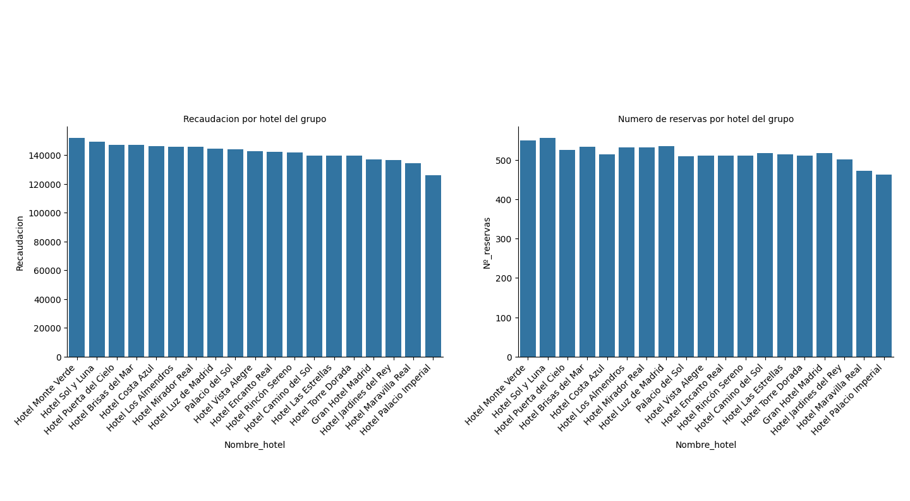
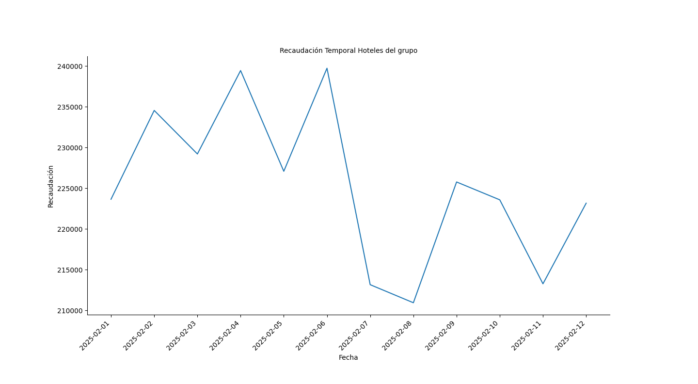
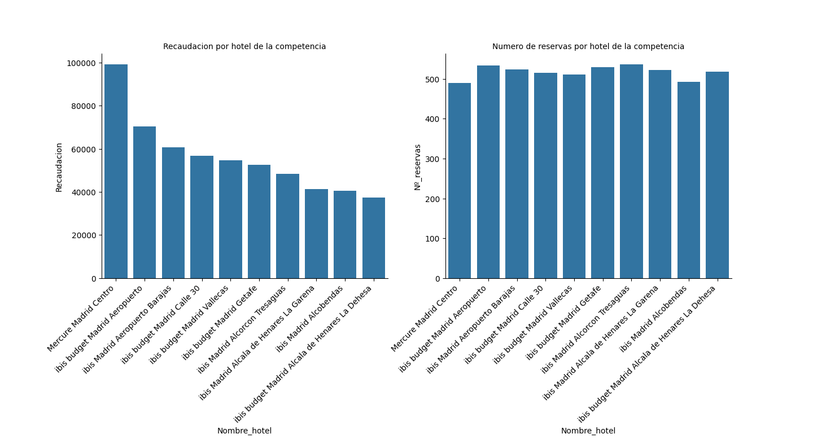

# "Informe de Resultados: Análisis de Reservas y Competencia en el Sector Hotelero de Madrid"

## Índice

1. **Introducción**  
2. **Metodología**
3. **Resultados clave**  
4. **Próximos pasos**

## Introducción  

Nuestra empresa, como compañía del sector hotelero, está buscando optimizar la toma de decisiones basándose en el análisis de datos clave de la compañía. Por ello, en este proyecto hemos realizado un análisis de las métricas principales de los hoteles del grupo y de la competencia con el propósito de establecer la posición de la compañía en el mercado hotelero de Madrid. La finalidad de este informe es presentar el flujo de trabajo seguido durante el análisis de la información, la cual se ha realizado a través de un proceso de ETL y visualización. 

## Metodología

El enfoque utilizado en este proyecto se basa en el método de ETL (Extract, Transform, Load), mediante el cual se ha realizado la extracción, transformación y carga de los datos de las reservas de los hoteles del grupo y de la competencia. El flujo de trabajo se ha dividido en varias fases, cada una con un propósito único. A continuación describimos brevemente lo realizado en cada fase.

### Extracción

La extracción, como primera parte de una ETL, ha consistido en la obtención de información a partir de archivos propios de la compañía, de internet (mediante web scraping) y de una API. 

Para obtener información de los eventos entre las fechas de estancia de los clientes, hemos hecho uso de una API de eventos de Madrid, la cual proporciona datos sobre los eventos programados en Madrid. El objetivo de esta extracción sería analizar el impacto de la existencia de eventos en la demanda hotelera en un período de tiempo determinado. 

La información de los hoteles de la competencia ha sido obtenida mediante el uso de Web Scraping con la librería Selenium, la cual permite extraer datos relevantes, como los nombres, los precios y las valoraciones de los hoteles de la competencia, así como guardarlos en un formato estructurado para su análisis posterior.

El análisis de los hoteles del grupo se ha hecho a partir de un archivo de tipo parquet proporcionado por la compañía. Este archivo contiene información sobre las reservas, los nombres de los hoteles, sus precios y valoracines, así como los clientes que han realizado las reservas del grupo y de la competencia. 

### Transformación

Una vez realizada la extracción se pasa a la fase de transformación, en la cual hemos hecho una limpieza e integración de los datos obtenidos de las diversas fuentes. En la limpieza hemos hecho un manejo de valores nulos, de la competencia principalmente, reemplazándolos por la información obtenida de la competencia, así como de valores duplicados ya que en numerosos casos encontramos inconsistencia en los datos, por ejemplo en los ids de cliente y de hotel. Asimismo se ha realizado una normalización de los precios de los hoteles del grupo así como de las valoraciones de cada uno. 

Para poder realizar la carga hemos hecho un proceso de integración de todos los datos extraídos, además de estandarizar los formatos de los datos. Por ejemplo las fechas de reservas fueron transformadas a un formato único para facilitar las consultas en la base posteriormente.

### Carga 

Una vez normalizados y completados todos los datos, se procede a la carga de la información a una base previamente creada mediante PostgreSQL. Esto nos permite almacenar los datos en una base de datos relacional, de forma estructurada, lo que facilita su consulta posterior para realizar el análisis. Para optimizar las consultas entre los hoteles del grupo y de la competencia se han creado vistas de los mismos. A continuación se puede ver la estructura de la base:

    

### Análisis

Finalmente, tras la carga de los datos se ha llevado a cabo un análisis de la información a través de consultas de SQL y métodos de visualización de python. Se han calculado métricas (big numbers) y visualizaciones de la competencia y del grupo.

## Resultados clave

Hemos realizado un análisis de los datos obtenidos y hemos obtenido una serie de insights los cuales comentamos a continuación.

### Big Numbers

Los hoteles del grupo han obtenido una recaudación total superior a los de la competencia en el período analizado. Asimismo, podemos observar que el precio medio de nuestros hoteles es significativamente superior al de la competencia. Sin embargo la valoración media de los hoteles del grupo es inferior, casi con un punto y medio de diferencia. En cuanto al número de reservas realizadas para el fin de semana analizado, observamos que los hoteles del grupo tienen un número superior de reservas. 

| Métrica            | Hoteles_Grupo | Hoteles_Competencia  |
|--------------------|---------------|----------------------|
| Recaudación Total  | 2.703.317,14    | 561.494            |
| Precio Medio       | 275.06        | 108,56              |
| Reservas Totales   | 9.828          | 5.172                |
| Valoración Media   | 3,01          | 4,33                |

### Visualizaciones

En este apartado realizamos un análisis temporal de la recaudacion obtenida por los hoteles del grupo, así como de la recaudaciñon y de las reservas por hotel. De la competencia solo podemos obtener información sobre los hoteles, ya que la fecha de reserva se establece el día en que el web scraping de la información es realizado.

`Hoteles del grupo`

Podemos observar que la recaudación de los hoteles ha sido bastante similar en todos los casos. El hotel que ha obtenido una mayor recaudación ha sido el Hotel Monte Verde, y el que menos el Hotel Palacio Imperial. En cuanto al número de reservas, observamos una casuística similar. En este caso el hotel con el mayor número de reservas ha sido el Hotel Sol y Luna, y el que menos ha sido el Hotel Palacio Imperial.

    

Si analizamos la recaudación obtenida de temporalmente durante la primera mitad del mes de febrero, podemos observar que la primera semana ha tenido un volumen de recaudacion significativamente superior al de la segunda semana. Asimismo vemos que la recaudacion no presenta una tendencia clara, sino una alta variabilidad a lo largo del periodo. El pico más alto de recaudacion se encuentra en el día 6 del mes y el más bajo el día 8 del mes. 

    

`Hoteles de la competencia`

En el caso de los hoteles de la competencia podemos observar que la recaudaciñon varía significativamente en cada hotel. EL hotel que ha obtenido una mayor recaudación ha sido el ibis Madrid Centro las Ventas, y el que menos el ibis budget Madrid Alcorcón Móstoles. 

En el caso de las reservas por hotel pasa al contrario, hay una gran similitud en las reservas realizadas por hotel. El hotel con el mayor número de reservas ha sido el ibis budget Madrid Centro las Ventas, y el que menos ha sido el ibis Madrid Aerouperto Barajas. 

    

## Conclusiones y próximos pasos

Los resultados obtenidos nos permiten identificar áreas de mejora en los hoteles del grupo. A continuación realizamos un resumen de las mismas:
- La compañía presenta una recaudación y un número de reservas adecuado. Sin embargo, se recomienda revisar los factores influyentes en la valoración de la compañía, ya que esta es reducida. 
- Conviene analizar las razones de la baja productividad obtenida por el hotel Palacio Imperial.

Para futuros análisis se realizan las siguiente recomendaciones:
- Revisar la tendencia de recaudación para identificar tendencias de reservas en los clientes.
- Obtener información sobre la asistencia de los clientes a los eventos en las fechas de estancia analizadas.

